# Web開発入門講座 - シンプル投稿アプリで学ぶ基本概念

> **目標**: フロントエンド・バックエンド・API・DB・SQLの基本概念をシンプルな構成で実践的に理解する

---

## 📚 講座の流れ

**⚠️ 初学者の方へ：まず「1. アプリを動かしてみよう」で実際の動作を確認してから始めてください！**

1. **🚀 アプリを動かしてみよう**　← まずはここから！
2. **🏗️ アーキテクチャを理解しよう**　← 全体像を把握！
3. **🎨 フロントエンドのコードを読んでいこう**
4. **⚙️ バックエンドのコードを読んでいこう**
5. **🚀 実践演習：投稿削除機能を実装してみよう**

---

## 🚀 1. アプリを動かしてみよう

### 1.1 必要なツールの準備（Mac向け）

#### Dockerのインストールと確認

```bash
# Docker Desktop のインストール（Homebrewが入っている場合）
brew install --cask docker

# Dockerが動作していることを確認
docker --version
docker-compose --version
```

⚠️ **注意**: Docker Desktop の初回起動時は管理者権限が必要です。パスワード入力を求められた場合は入力してください。

### 1.2 アプリを起動してみよう

⚠️ **初回起動時の注意**
- 初回起動時はDockerイメージのダウンロードに時間がかかります（5-10分程度）
- データベースの初期化も自動で行われます

ターミナルで以下のコマンドを実行：

```bash
# 1. プロジェクトフォルダに移動
cd web-app-simple

# 2. infraディレクトリに移動
cd infra

# 3. 開発環境を起動（初回は時間がかかります）
docker-compose up --build -d

# もしポート競合エラーが出た場合
docker-compose down  # 一度停止
docker-compose up --build -d  # 再起動
```

### 1.3 動作確認

以下のURLにアクセスしてみましょう：

1. **フロントエンド（画面）**: http://localhost:5173
   - 投稿アプリの画面が表示される
   
2. **バックエンド（API）**: http://localhost:8000/docs
   - API の仕様書が表示される

### 1.4 基本操作を試してみよう

1. 画面に「投稿内容を入力」欄があることを確認
2. 何か文字を入力して「投稿」ボタンを押す
3. 投稿が一覧に表示されることを確認

**🎯 ここで体験できること：**
- フロントエンド → バックエンド → データベースの連携
- リアルタイムでのデータ反映

### 1.5 プロジェクトの全体構造

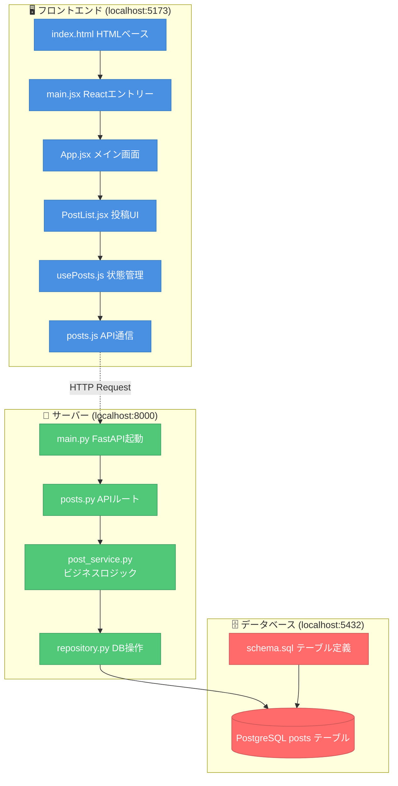

### 1.6 Web開発の3つの要素（シンプル版）

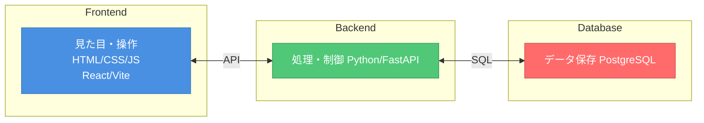

**それぞれの役割：**

| 要素 | 役割 | 身近な例 |
|------|------|----------|
| **フロントエンド** | ユーザーが見る画面と操作 | スマホアプリの画面、ボタン |
| **バックエンド** | データ処理、ビジネスロジック（アプリのルール） | 「いいね」の数を計算する |
| **データベース** | データの保存と管理 | 投稿内容、ユーザー情報 |

### API（エーピーアイ）とは？
- **API** = Application Programming Interface
- フロントエンドとバックエンドをつなぐ「橋」
- 「投稿を取得」「新しい投稿を保存」などの**やり取り**をする仕組み

### 1.7 データの流れ図

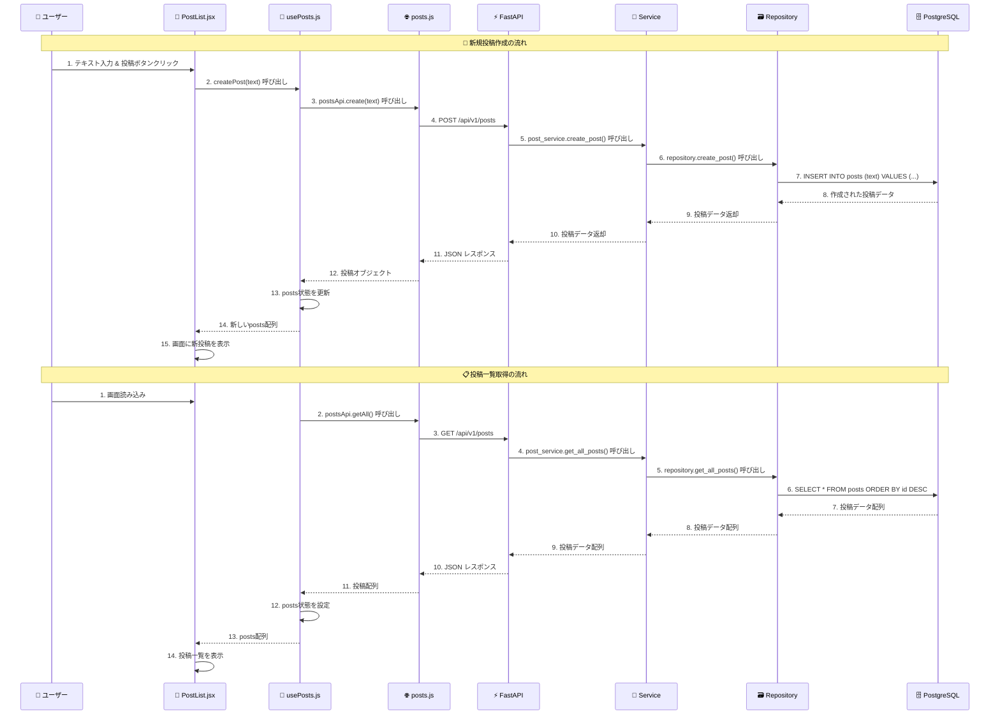

---

## 🏗️ 2. アーキテクチャを理解しよう

**このセクションの目的：** コードを読む前に、アプリ全体がどのように構成されているかを理解しましょう。

### 2.1 Web開発の3つの要素


**それぞれの役割：**

| 要素 | 役割 | 身近な例 |
|------|------|----------|
| **フロントエンド** | ユーザーが見る画面と操作 | スマホアプリの画面、ボタン |
| **バックエンド** | データ処理、ビジネスロジック（アプリのルール） | 「いいね」の数を計算する |
| **データベース** | データの保存と管理 | 投稿内容、ユーザー情報 |

### API（エーピーアイ）とは？
- **API** = Application Programming Interface
- フロントエンドとバックエンドをつなぐ「橋」
- 「投稿を取得」「新しい投稿を保存」などの**やり取り**をする仕組み

### 2.2 レイヤードアーキテクチャ（階層型設計）

**重要：** このアプリは「レイヤードアーキテクチャ」という設計パターンで作られています。

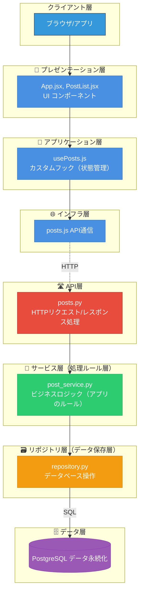

**各層の役割：**

| 層 | 責任 | 実際のファイル | 何をする？ |
|----|----|-------------|----------|
| **🎨 プレゼンテーション層** | 画面表示・ユーザー操作 | `App.jsx`, `PostList.jsx` | ボタン、フォーム、一覧表示 |
| **🔄 アプリケーション層** | 状態管理・画面ロジック | `usePosts.js` | データの保持、画面状態の管理 |
| **🌐 インフラ層** | 外部通信 | `posts.js` | サーバーとの HTTP 通信 |
| **🛣️ API層** | HTTP処理 | `posts.py` | URLのルーティング、リクエスト処理 |
| **💼 サービス層** | ビジネスロジック | `post_service.py` | アプリのルール（文字数制限など） |
| **🗃️ リポジトリ層** | データアクセス | `repository.py` | SQL実行、データベース操作 |
| **🗄️ データ層** | データ永続化 | `schema.sql`, PostgreSQL | データの保存・管理 |

**なぜ分けるの？**
- **責任の分離**: 各層が専門的な役割を持つ
- **テストしやすい**: 各層を独立してテストできる
- **変更に強い**: 一つの層の変更が他に影響しにくい
- **理解しやすい**: どこに何があるかが明確

### 2.3 実際のフォルダ構造との対応

```
web-app-simple/
├── 📁 client/                    # 🎨 フロントエンド全体
│   ├── src/
│   │   ├── App.jsx              # 🎨 プレゼンテーション層
│   │   ├── components/
│   │   │   └── PostList.jsx     # 🎨 プレゼンテーション層
│   │   ├── hooks/
│   │   │   └── usePosts.js      # 🔄 アプリケーション層
│   │   └── api/
│   │       └── posts.js         # 🌐 インフラ層
├── 📁 server/                    # ⚙️ バックエンド全体
│   ├── app/
│   │   ├── main.py              # 🛣️ API層（エントリーポイント）
│   │   ├── api/v1/
│   │   │   └── posts.py         # 🛣️ API層
│   │   ├── services/
│   │   │   └── post_service.py  # 💼 サービス層
│   │   ├── db/
│   │   │   ├── repository.py    # 🗃️ リポジトリ層
│   │   │   └── schema.sql       # 🗄️ データ層
└── 📁 infra/
    └── docker-compose.yml       # 🔧 インフラ設定
```

**🎯 これから読む順序：**
1. **フロントエンド**（上から下へ）: `App.jsx` → `PostList.jsx` → `usePosts.js` → `posts.js`
2. **バックエンド**（上から下へ）: `main.py` → `posts.py` → `post_service.py` → `repository.py` → `schema.sql`

---

## 🎨 3. フロントエンドのコードを読んでいこう

### 3.1 フロントエンドのファイル構造

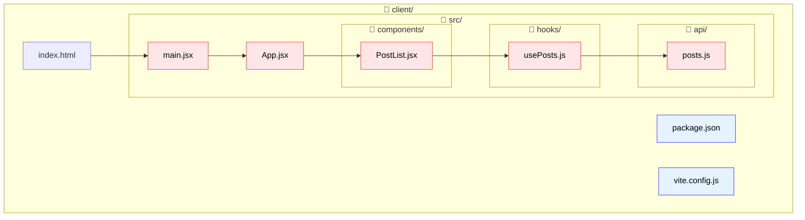

**🔍 読む順序：** `index.html` → `main.jsx` → `App.jsx` → `PostList.jsx` → `usePosts.js` → `posts.js`

### 3.2 index.html - Webアプリの土台

**ファイルパス**: `client/index.html`

```html
<!doctype html>
<html lang="en">
  <head>
    <meta charset="UTF-8" />
    <link rel="icon" type="image/svg+xml" href="/vite.svg" />
    <meta name="viewport" content="width=device-width, initial-scale=1.0" />
    <title>FastAPI React Starter</title>
  </head>
  <body>
    <!-- React アプリがマウントされるコンテナ -->
    <div id="root"></div>
    <!-- React アプリのエントリーポイント -->
    <script type="module" src="/src/main.jsx"></script>
  </body>
</html>
```

**🎯 重要ポイント：**
- `<div id="root"></div>` : React アプリが描画される場所
- `<script type="module" src="/src/main.jsx"></script>` : React アプリの開始点
- シンプルな HTML 構造で、実際のコンテンツは React が動的に生成

### 3.3 main.jsx - Reactアプリのエントリーポイント

**ファイルパス**: `client/src/main.jsx`

```javascript
import React from 'react'
import ReactDOM from 'react-dom/client'
import App from './App.jsx'

// HTMLの #root 要素に React アプリをマウント
ReactDOM.createRoot(document.getElementById('root')).render(
  <React.StrictMode>
    <App />
  </React.StrictMode>,
)
```

**🎯 重要ポイント：**
- `ReactDOM.createRoot()` : React 18 の新しい API で React アプリを初期化
- `React.StrictMode` : 開発時の潜在的な問題を検出するモード
- `<App />` : メインコンポーネントを描画

### 3.4 App.jsx - メイン画面コンポーネント

**ファイルパス**: `client/src/App.jsx`

```javascript
// 必要なコンポーネントとフック（機能）を読み込む
import { PostList } from './components/PostList';  // 投稿一覧を表示するコンポーネント
import { usePosts } from './hooks/usePosts';        // 投稿データを管理するカスタムフック

// App関数コンポーネント：アプリケーション全体のメイン画面
function App() {
  // usePosts カスタムフックから投稿に関する機能を取得
  // これにより、投稿データの状態管理とAPI通信が自動で行われる
  const { 
    posts,      // 投稿データの配列（例：[{id: 1, text: "投稿1"}, {id: 2, text: "投稿2"}]）
    loading,    // データ読み込み中かどうかを示すフラグ（true/false）
    error,      // エラーが発生した場合のエラーメッセージ
    createPost  // 新しい投稿を作成する関数
  } = usePosts();

  // JSX（JavaScript XML）: HTMLに似た記法でUIを記述
  // returnの中に書かれた内容が画面に表示される
  return (
    <div style={{ padding: '20px' }}>
      {/* アプリケーションのタイトル */}
      <h1>FastAPI + React Posts App</h1>
      
      {/* PostListコンポーネントに必要なデータと機能を渡す（propsという仕組み） */}
      <PostList 
        posts={posts}                    // 投稿データを子コンポーネントに渡す
        loading={loading}                // 読み込み状態を子コンポーネントに渡す
        error={error}                    // エラー情報を子コンポーネントに渡す
        onCreatePost={createPost}        // 投稿作成機能を子コンポーネントに渡す
      />
    </div>
  );
}

// このコンポーネントを他のファイルで使えるようにエクスポート
export default App;
```

**🎯 処理の流れ：**

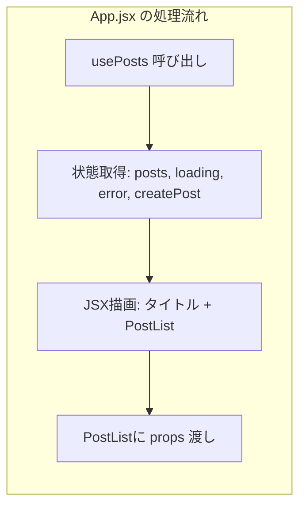

**重要ポイント：**
- **カスタムフック**: `usePosts()` で投稿関連の状態と機能をまとめて取得
- **コンポーネントの分離**: App は PostList にデータを渡すだけの役割
- **props**: 親から子コンポーネントにデータを渡す React の仕組み

### 3.5 PostList.jsx - 投稿一覧とフォームのUI

**ファイルパス**: `client/src/components/PostList.jsx`

```javascript
// React の useState フックをインポート（コンポーネント内でデータの状態を管理するため）
import { useState } from 'react';

// PostList コンポーネント：投稿の一覧表示と新規投稿作成機能を担当
// props（引数）として親コンポーネント（App.jsx）から以下のデータを受け取る
export function PostList({ posts, loading, error, onCreatePost }) {
  // useState フック：コンポーネント内でデータの状態を管理する
  // [現在の値, 値を変更する関数] = useState(初期値) の形で使用
  const [text, setText] = useState('');           // 入力フォームのテキスト
  const [creating, setCreating] = useState(false); // 投稿作成中かどうかのフラグ
  const [createError, setCreateError] = useState(''); // 投稿作成時のエラーメッセージ

  // フォーム送信時の処理を行う関数
  // async: 非同期処理（APIとの通信など時間のかかる処理）を扱うためのキーワード
  const handleSubmit = async (e) => {
    // preventDefault(): フォーム送信のデフォルト動作（ページリロード）を止める
    e.preventDefault();
    
    // 入力値のバリデーション（検証）
    // trim(): 文字列の前後の空白を除去。空文字だけの場合は false になる
    if (!text.trim()) {
      setCreateError('テキストを入力してください');
      return; // 処理を終了（以下のコードは実行されない）
    }

    // 文字数制限のチェック
    if (text.length > 255) {
      setCreateError('テキストは255文字以内で入力してください');
      return;
    }

    // 投稿作成処理の開始
    setCreating(true);      // 作成中フラグを true に（ボタンを無効化するため）
    setCreateError('');     // 前回のエラーメッセージをクリア
    
    // await: 非同期処理の完了を待つ。onCreatePost は親から受け取った投稿作成関数
    const result = await onCreatePost(text);
    
    // 投稿作成の結果によって処理を分岐
    if (result.success) {
      setText('');  // 成功時：入力フォームをクリア
    } else {
      setCreateError(result.error);  // 失敗時：エラーメッセージを表示
    }
    
    setCreating(false);  // 作成中フラグを false に戻す
  };

  // 早期リターン：特定の条件時は画面の表示を変える
  // loading が true の場合、以下の JSX は実行されず「読み込み中...」だけが表示される
  if (loading) return <div>読み込み中...</div>;
  if (error) return <div>エラー: {error}</div>;

  // メインの JSX：通常時に表示される画面の構造
  return (
    <div>
      {/* 投稿作成フォーム */}
      {/* onSubmit: フォーム送信時に実行される関数を指定 */}
      <form onSubmit={handleSubmit} style={{ marginBottom: '20px' }}>
        <div>
          {/* 入力フィールド */}
          <input
            type="text"
            value={text}                          // 現在の入力値（state で管理）
            onChange={(e) => setText(e.target.value)}  // 入力値が変わった時の処理
            placeholder="投稿内容を入力"            // 未入力時に表示されるヒント
            style={{ 
              width: '300px', 
              padding: '8px',
              marginRight: '10px'
            }}
            disabled={creating}                   // 投稿作成中は入力を無効化
          />
          {/* 投稿ボタン */}
          <button type="submit" disabled={creating}>
            {/* 三項演算子：条件 ? 真の場合 : 偽の場合 */}
            {creating ? '投稿中...' : '投稿'}
          </button>
        </div>
        {/* 条件付きレンダリング：createError が存在する場合のみ表示 */}
        {createError && (
          <div style={{ color: 'red', marginTop: '5px' }}>
            {createError}
          </div>
        )}
      </form>

      {/* 投稿一覧表示部分 */}
      <div>
        <h2>投稿一覧</h2>
        {/* 三項演算子で投稿の有無によって表示を切り替え */}
        {posts.length === 0 ? (
          <p>投稿がありません</p>
        ) : (
          <ul>
            {/* map 関数：配列の各要素に対して処理を実行し、新しい配列を作成 */}
            {/* ここでは各投稿データを <li> 要素に変換している */}
            {posts.map(post => (
              <li key={post.id}>  {/* key: React が要素を識別するための一意な値 */}
                {post.text} (ID: {post.id})
              </li>
            ))}
          </ul>
        )}
      </div>
    </div>
  );
}
```

**🎯 PostList.jsx の処理流れ：**

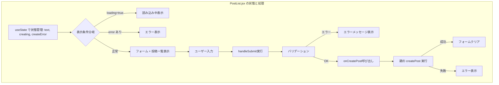

### 3.6 usePosts.js - データ管理とAPI通信の橋渡し

**ファイルパス**: `client/src/hooks/usePosts.js`

```javascript
// React の useState と useEffect フックをインポート
import { useState, useEffect } from 'react';
// API 通信を行う関数をインポート
import { postsApi } from '../api/posts';

// カスタムフック：投稿関連の状態管理とAPI通信をまとめた再利用可能な機能
// 「use」で始まる関数名にすることで React がフックとして認識する
export function usePosts() {
  // 状態管理：useState フックで各種状態を定義
  const [posts, setPosts] = useState([]);        // 投稿データの配列
  const [loading, setLoading] = useState(true);  // データ読み込み中フラグ
  const [error, setError] = useState(null);      // エラー情報

  // 投稿一覧を取得する非同期関数
  const fetchPosts = async () => {
    try {
      // try-catch 文：エラーが発生する可能性のある処理を安全に実行
      setLoading(true);  // 読み込み開始
      
      // API から投稿データを取得（await で完了を待つ）
      const data = await postsApi.getAll();
      
      setPosts(data);    // 取得したデータで状態を更新
      setError(null);    // エラーをクリア
    } catch (err) {
      // API 通信でエラーが発生した場合の処理
      setError(err.message);
    } finally {
      // try または catch のどちらが実行されても最後に必ず実行される
      setLoading(false);  // 読み込み完了
    }
  };

  // 新しい投稿を作成する非同期関数
  const createPost = async (text) => {
    try {
      // API に新しい投稿を送信
      const newPost = await postsApi.create(text);
      
      // スプレッド演算子（...）を使って新しい投稿を配列の先頭に追加
      // [newPost, ...posts] は [新しい投稿, 既存の投稿1, 既存の投稿2, ...] という配列になる
      setPosts([newPost, ...posts]);
      
      // 成功時は success: true を返す
      return { success: true };
    } catch (err) {
      // 失敗時は success: false とエラーメッセージを返す
      return { success: false, error: err.message };
    }
  };

  // useEffect フック：コンポーネントの生存期間中の特定のタイミングで処理を実行
  // 第二引数の配列（依存配列）が空の場合、コンポーネントの初回マウント時のみ実行
  useEffect(() => {
    fetchPosts();  // コンポーネント表示時に投稿一覧を取得
  }, []); // 空の依存配列 = 初回のみ実行

  // このカスタムフックを使用するコンポーネントに提供する値や関数
  return {
    posts,           // 投稿データの配列
    loading,         // 読み込み中フラグ
    error,           // エラー情報
    createPost,      // 投稿作成関数
    refetch: fetchPosts  // データ再取得関数（refetch という名前で fetchPosts を提供）
  };
}
```

**🎯 usePosts.js の処理流れ：**

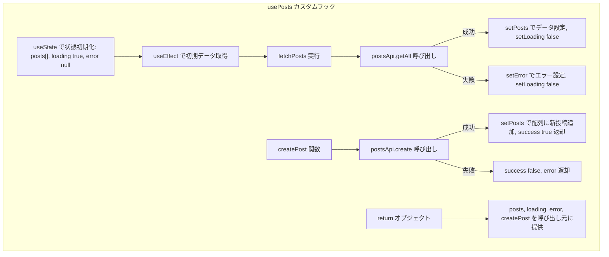

### 3.7 posts.js - API通信の実装

**ファイルパス**: `client/src/api/posts.js`

```javascript
// API のベース URL を定数として定義
// '/api/v1' は vite.config.js でプロキシ設定により http://localhost:8000/api/v1 に転送される
const API_BASE = '/api/v1';

// 投稿関連の API 通信を行う関数をまとめたオブジェクト
export const postsApi = {
  // 投稿一覧を取得する関数（HTTP GET リクエスト）
  async getAll() {
    // fetch() : ブラウザ標準の HTTP 通信機能
    // テンプレートリテラル（``）を使って URL を構築: /api/v1/posts
    const response = await fetch(`${API_BASE}/posts`);
    
    // response.ok : HTTP ステータスコードが 200-299 の範囲かチェック
    if (!response.ok) {
      // エラー時は Error オブジェクトを投げる（throw）
      // これにより呼び出し元の catch ブロックでエラーをキャッチできる
      throw new Error('Failed to fetch posts');
    }
    
    // response.json() : レスポンスの JSON データを JavaScript オブジェクトに変換
    return response.json();
  },

  // 新しい投稿を作成する関数（HTTP POST リクエスト）
  async create(text) {
    const response = await fetch(`${API_BASE}/posts`, {
      method: 'POST',  // HTTP メソッドを POST に指定
      
      // HTTP ヘッダー：サーバーにリクエストの詳細情報を伝える
      headers: {
        'Content-Type': 'application/json',  // JSON 形式でデータを送信することを明示
      },
      
      // リクエストボディ：サーバーに送信するデータ
      // JSON.stringify() : JavaScript オブジェクトを JSON 文字列に変換
      // { text } は { text: text } の省略記法（ES6 のプロパティ短縮記法）
      body: JSON.stringify({ text }),
    });
    
    // レスポンスのエラーチェック
    if (!response.ok) {
      // サーバーからのエラーレスポンスを JSON として取得
      const error = await response.json();
      
      // error.detail があればそれを、なければデフォルトメッセージを使用
      // || 演算子：左側が falsy（undefined, null, '' など）なら右側を使用
      throw new Error(error.detail || 'Failed to create post');
    }
    
    // 成功時は作成された投稿データを JSON として返す
    return response.json();
  }
};
```

**🎯 API通信の流れ：**

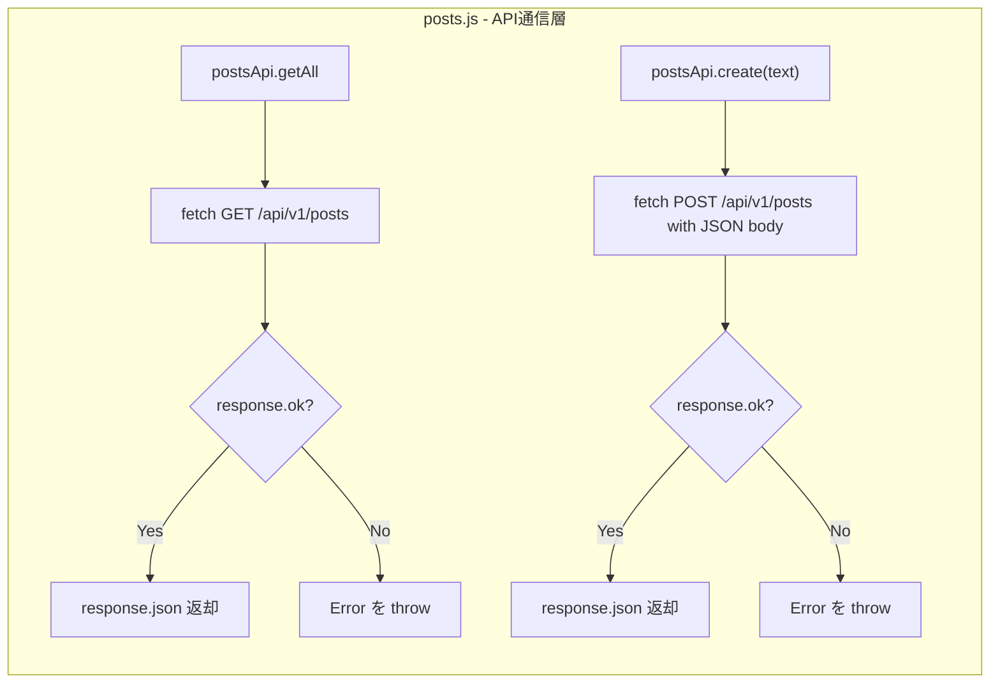

### 3.8 フロントエンド全体のデータフロー

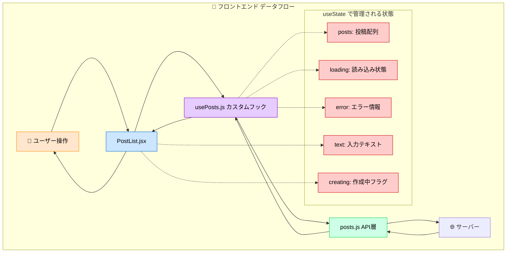

### 3.9 フロントエンド設計パターンと原則

#### 3.9.1 コンポーネント設計パターン

**📋 このアプリで採用している設計パターン：**

1. **Container/Presentational パターン**
   - **Container（App.jsx）**: データ管理とロジック
   - **Presentational（PostList.jsx）**: UI表示とユーザー操作

2. **Custom Hooks パターン**
   - **usePosts.js**: ビジネスロジックを再利用可能な形で抽象化

3. **Props Drilling パターン**
   - 親から子へのデータ受け渡し

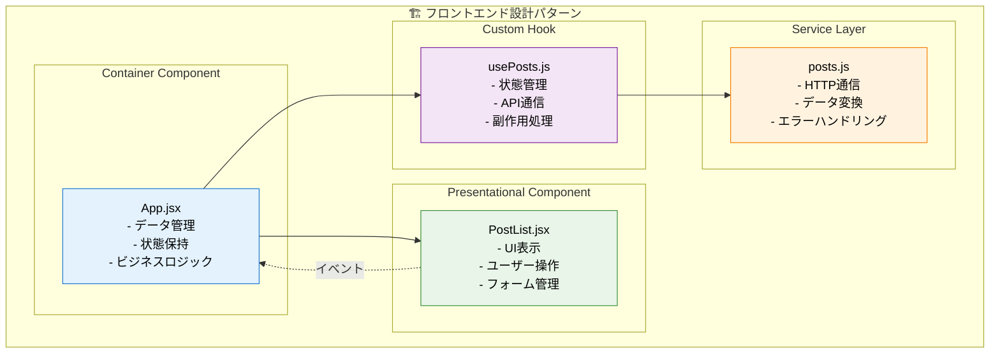

#### 3.9.2 状態管理の設計

**🔄 状態の種類と管理場所：**

| 状態の種類 | 管理場所 | 理由 | 例 |
|-----------|---------|------|-----|
| **グローバル状態** | usePosts (Custom Hook) | アプリ全体で共有 | posts配列、loading状態 |
| **ローカル状態** | PostList (Component) | そのコンポーネントのみで使用 | 入力フォームのtext |
| **派生状態** | 計算で求める | 冗長性を避ける | 投稿数（posts.length） |

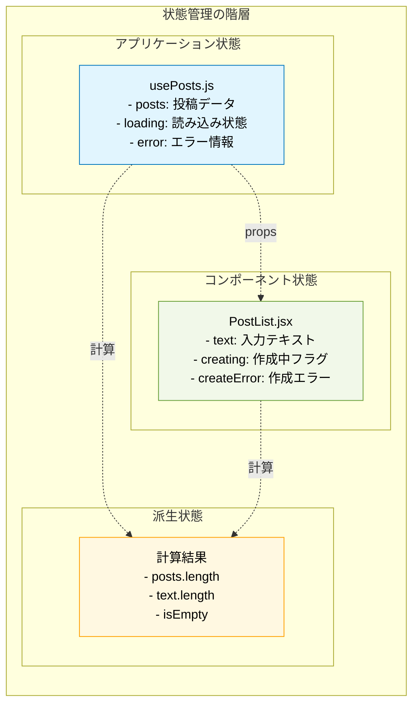

#### 3.9.3 イベントハンドリングパターン

**⚡ イベントの流れ：**

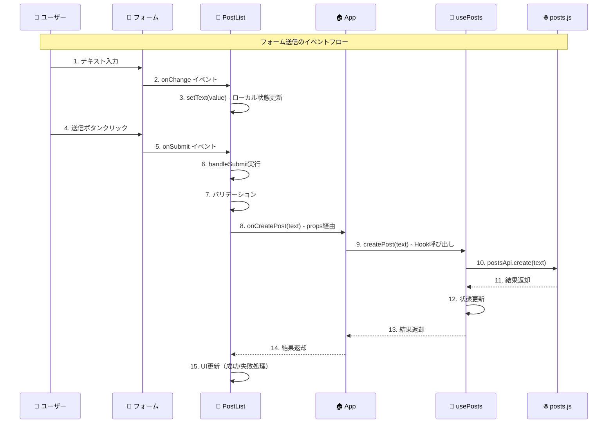

#### 3.9.4 Reactの設計原則

**📐 このアプリで実践している設計原則：**

1. **単一責任の原則 (SRP)**
   - App.jsx: データの橋渡し
   - PostList.jsx: UI表示
   - usePosts.js: 状態管理
   - posts.js: API通信

2. **関心の分離 (Separation of Concerns)**
   ```
   📱 UI層: PostList.jsx（見た目）
   🔄 状態層: usePosts.js（データ管理）
   🌐 通信層: posts.js（API）
   ```

3. **データの一方向フロー (Unidirectional Data Flow)**
   ```
   親コンポーネント → props → 子コンポーネント
   子コンポーネント → callback → 親コンポーネント
   ```

#### 3.9.5 エラーハンドリング戦略

**🚨 エラー処理の階層化：**

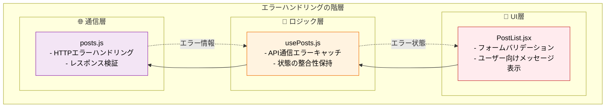

**エラー処理の具体例：**

| 層 | エラーの種類 | 処理方法 | ユーザーへの表示 |
|----|-------------|----------|-----------------|
| **UI層** | 入力値検証 | フォームレベルでチェック | "テキストを入力してください" |
| **ロジック層** | API通信失敗 | try-catch でキャッチ | "通信エラーが発生しました" |
| **通信層** | HTTPエラー | response.ok をチェック | サーバーエラーメッセージ |

#### 3.9.6 パフォーマンス考慮事項

**⚡ このアプリでのパフォーマンス戦略：**

1. **状態更新の最適化**
   - 必要最小限の状態のみ更新
   - 状態を適切な場所で管理（グローバル vs ローカル）

2. **レンダリング最適化**
   - 関数の再作成を避ける（useCallback は今回は不要な規模）
   - 状態の分離により無駄な再レンダリングを防止

3. **データフェッチング戦略**
   - 初回マウント時のみデータ取得
   - 楽観的更新（投稿後すぐにUI更新）

#### 3.9.7 テスタビリティの設計

**🧪 テストしやすい設計：**

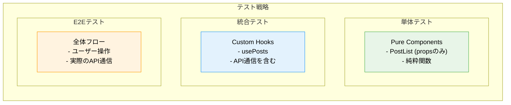

**テストしやすい理由：**
- PostList.jsx は props のみに依存（純粋コンポーネント）
- usePosts.js はロジックが分離されている
- posts.js は単純な関数群

この設計により、各部分を独立してテストできる構造になっています。

---

## ⚙️ 4. バックエンドのコードを読んでいこう

### 4.1 バックエンドのファイル構造

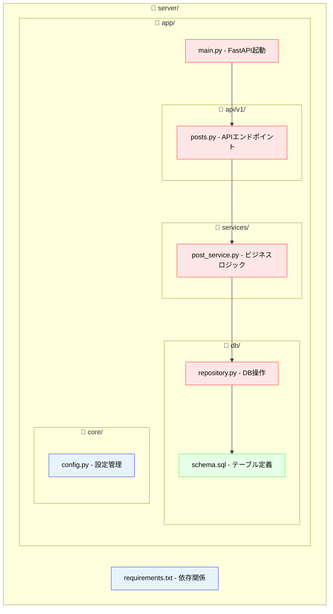

**🔍 読む順序：** `main.py` → `posts.py` → `post_service.py` → `repository.py` → `schema.sql`

### 4.2 main.py - FastAPIサーバーの起動

**ファイルパス**: `server/app/main.py`

```python
# FastAPI メインアプリケーションファイル
# このファイルはサーバーアプリケーションの全体的な設定と起動を担当する

# FastAPI の基本クラスとミドルウェアをインポート
from fastapi import FastAPI                      # Web API フレームワーク
from fastapi.middleware.cors import CORSMiddleware  # CORS (Cross-Origin Resource Sharing) 設定

# アプリケーション内のモジュールをインポート
from app.core.config import settings            # 設定管理
from app.api.v1 import posts                    # 投稿関連 API ルーター

# FastAPI アプリケーションインスタンスを作成
app = FastAPI()

# CORS ミドルウェアの設定
# CORS : ブラウザのセキュリティ機能で、異なるオリジン間の通信を制御
app.add_middleware(
    CORSMiddleware,
    allow_origins=settings.CORS_ORIGINS,    # 許可するオリジン（通常は React 開発サーバーのURL）
    allow_credentials=True,                  # 認証情報（Cookie）の送信を許可
    allow_methods=["*"],                     # 全ての HTTP メソッド（GET, POST, PUT, DELETE 等）を許可
    allow_headers=["*"],                     # 全ての HTTP ヘッダーを許可
)

# アプリケーション起動時の初期化処理
@app.on_event("startup")
async def startup_event():
    """アプリケーション起動時にデータベースを初期化"""
    await posts.startup()

# API ルーターを追加
# prefix=settings.API_PREFIX : 全ての API エンドポイントに /api/v1 のプレフィックスを追加
app.include_router(posts.router, prefix=settings.API_PREFIX)
```

**🎯 main.py の処理流れ：**

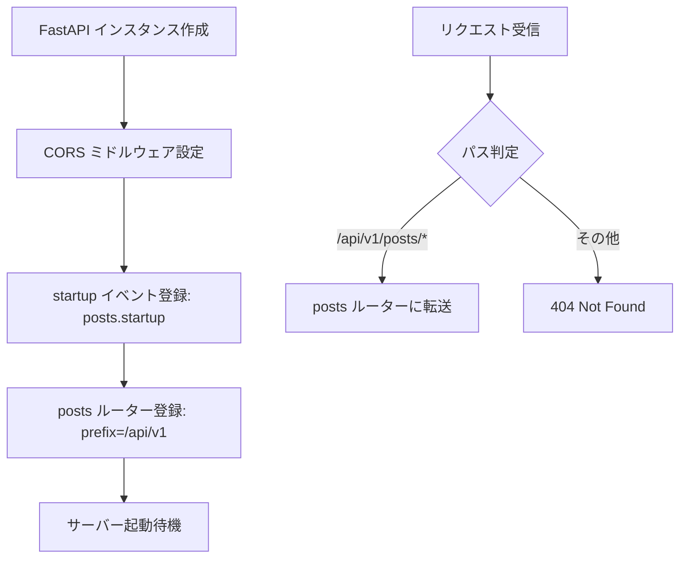

### 4.3 posts.py - APIエンドポイントの定義

**ファイルパス**: `server/app/api/v1/posts.py`

```python
# FastAPI の必要なモジュールをインポート
from fastapi import APIRouter, HTTPException            # APIルーター、例外
from pydantic import BaseModel, Field                  # データモデル定義、バリデーション
from typing import List                                # 型ヒント（リスト型）
from datetime import datetime                          # 日時データ型
from app.services import post_service                  # ビジネスロジック層
from app.db import repository                          # データベース操作層

# APIRouter: URL エンドポイントをグループ化するための仕組み
# このルーターに定義した関数が実際の API エンドポイントになる
router = APIRouter()


# Pydantic モデル：リクエストデータの構造とバリデーションルールを定義
class PostCreate(BaseModel):
    """投稿作成時に受け取るデータの形式を定義"""
    # Field(..., min_length=1, max_length=255)
    # ... : 必須フィールドであることを示す
    # min_length=1 : 最低1文字以上
    # max_length=255 : 最大255文字まで
    text: str = Field(..., min_length=1, max_length=255)


# Pydantic モデル：レスポンスデータの構造を定義
class PostResponse(BaseModel):
    """API レスポンスとして返す投稿データの形式を定義"""
    id: int                # 投稿ID
    text: str              # 投稿内容
    created_at: datetime   # 作成日時


# アプリケーション起動時にデータベースを初期化
async def startup():
    """アプリケーション起動時の初期化処理"""
    await repository.init_db()


# GET /posts エンドポイント：投稿一覧を取得
# @router.get() : HTTP GET メソッドでアクセス可能にするデコレータ
# response_model=List[PostResponse] : レスポンスの型を指定（PostResponse のリスト）
@router.get("/posts", response_model=List[PostResponse])
async def get_posts():
    """投稿一覧を取得する API エンドポイント"""
    # サービス層に処理を委譲（レイヤードアーキテクチャの実践）
    posts = await post_service.get_all_posts()
    return posts  # FastAPI が自動で JSON に変換してレスポンス


# POST /posts エンドポイント：新しい投稿を作成
@router.post("/posts", response_model=PostResponse)
async def create_post(
    # post_data: PostCreate で自動的にリクエストボディをバリデーション
    post_data: PostCreate
):
    """新しい投稿を作成する API エンドポイント"""
    try:
        # サービス層で投稿作成処理を実行
        post = await post_service.create_post(post_data.text)
        return post
    except ValueError as e:
        # ValueError（ビジネスロジックエラー）を HTTP 400 エラーに変換
        # HTTPException : FastAPI の例外クラス
        # status_code=400 : Bad Request（クライアントエラー）
        # detail : エラーメッセージ
        raise HTTPException(status_code=400, detail=str(e))
```

**🎯 posts.py のAPI処理流れ：**

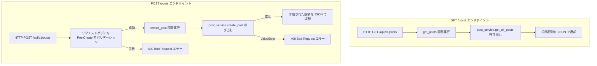

### 4.4 post_service.py - ビジネスロジックの実装

**ファイルパス**: `server/app/services/post_service.py`

```python
# ビジネスロジック層（サービス層）
# APIとデータベースの間に位置し、アプリケーションの中核的な処理を担当
# データの検証、ビジネスルールの実装などを行う

from typing import List, Dict
from app.db import repository  # データベース操作層


# 全ての投稿を取得する関数
async def get_all_posts() -> List[Dict]:
    """
    全ての投稿を取得する
    
    ビジネスロジック：
    - データベースから投稿一覧を取得
    
    戻り値: 投稿データの辞書のリスト
    """
    # リポジトリ層に処理を委譲（データアクセスの詳細は隠蔽）
    posts = await repository.get_all_posts()
    return posts


# 新しい投稿を作成する関数
async def create_post(text: str) -> Dict:
    """
    新しい投稿を作成する
    
    ビジネスルール：
    - 投稿内容は1文字以上255文字以内である必要がある
    - 空文字列や空白のみの投稿は許可しない
    
    引数:
        text: 投稿内容
        
    戻り値: 作成された投稿データ
    
    例外:
        ValueError: ビジネスルール違反時（文字数制限等）
    """
    # ビジネスルール検証：文字数制限チェック
    # API層でも検証されるが、サービス層でも二重チェック（防御的プログラミング）
    if not text or len(text) > 255:
        # ValueError: ビジネスロジック関連のエラー
        # API層でHTTPステータス400に変換される
        raise ValueError("Text must be between 1 and 255 characters")
    
    # データベースに投稿を保存
    post = await repository.create_post(text)
    return post
```

**🎯 post_service.py の処理流れ：**

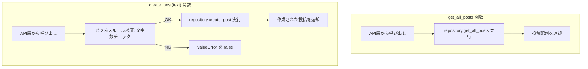

### 4.5 repository.py - データベース操作の実装

**ファイルパス**: `server/app/db/repository.py`

```python
import asyncpg
from typing import List, Dict
from app.core.config import settings

# データベース接続を取得する関数
async def get_db_connection():
    """
    PostgreSQL データベースへの接続を確立する
    
    戻り値: asyncpg.Connection オブジェクト
    """
    return await asyncpg.connect(settings.DATABASE_URL)

# データベースの初期化（テーブル作成）を行う関数
async def init_db():
    """
    データベースの初期化を行う
    schema.sql ファイルを読み込んでテーブルを作成
    """
    # SQL ファイルを読み込み
    with open("app/db/schema.sql", "r") as f:
        schema = f.read()
    
    # データベース接続を取得
    conn = await get_db_connection()
    try:
        # スキーマを実行（テーブル作成）
        await conn.execute(schema)
    finally:
        # 接続を必ず閉じる（finally ブロックで確実に実行）
        await conn.close()

# 全ての投稿を取得する関数
async def get_all_posts() -> List[Dict]:
    """
    データベースから全ての投稿を取得する
    
    戻り値: 投稿データの辞書のリスト
            [{"id": 1, "text": "投稿内容", "created_at": datetime}, ...]
    """
    conn = await get_db_connection()
    try:
        # SQL クエリを実行して投稿データを取得
        # ORDER BY id DESC : ID の降順（新しい投稿が先頭）でソート
        rows = await conn.fetch(
            "SELECT id, text, created_at FROM posts ORDER BY id DESC"
        )
        # asyncpg の Row オブジェクトを辞書形式に変換
        return [dict(row) for row in rows]
    finally:
        await conn.close()

# 新しい投稿を作成する関数
async def create_post(text: str) -> Dict:
    """
    新しい投稿をデータベースに保存する
    
    引数:
        text: 投稿内容
        
    戻り値: 作成された投稿データの辞書
           {"id": 新しいID, "text": "投稿内容", "created_at": datetime}
    """
    conn = await get_db_connection()
    try:
        # INSERT 文を実行して新しい投稿を作成
        # RETURNING : 作成されたレコードのデータを取得
        # $1 : プレースホルダー（SQLインジェクション対策）
        row = await conn.fetchrow(
            "INSERT INTO posts (text) VALUES ($1) RETURNING id, text, created_at",
            text
        )
        # Row オブジェクトを辞書形式に変換して返却
        return dict(row)
    finally:
        await conn.close()
```

**🎯 repository.py の処理流れ：**

```mermaid
graph TD
    subgraph "データベース操作の流れ"
        A["サービス層から呼び出し"] --> B["get_db_connection で接続取得"]
        B --> C{"処理種別"}
        
        C -->|初期化| D1["schema.sql 読み込み"]
        D1 --> E1["CREATE TABLE 実行"]
        E1 --> F1["接続クローズ"]
        
        C -->|一覧取得| D2["SELECT * FROM posts ORDER BY id DESC"]
        D2 --> E2["結果を辞書配列に変換"]
        E2 --> F2["接続クローズ"]
        
        C -->|新規作成| D3["INSERT INTO posts ... RETURNING ..."]
        D3 --> E3["作成されたレコードを辞書に変換"]
        E3 --> F3["接続クローズ"]
    end
```

### 4.6 schema.sql - データベーススキーマ定義

**ファイルパス**: `server/app/db/schema.sql`

```sql
-- posts テーブル：投稿データを保存するためのテーブル定義
-- このSQLファイルはアプリケーション起動時に実行され、必要なテーブルを作成します

CREATE TABLE IF NOT EXISTS posts (
    -- id: 投稿の一意識別子
    -- SERIAL: PostgreSQL の自動増分型（1, 2, 3... と自動で番号が振られる）
    -- PRIMARY KEY: 主キー（テーブル内で重複しない一意な値）
    id SERIAL PRIMARY KEY,
    
    -- text: 投稿の内容
    -- VARCHAR(255): 可変長文字列、最大255文字まで
    -- NOT NULL: 空の値（NULL）を許可しない
    text VARCHAR(255) NOT NULL,
    
    -- created_at: 投稿の作成日時
    -- TIMESTAMP: 日付と時刻を保存するデータ型
    -- DEFAULT CURRENT_TIMESTAMP: レコード作成時に現在時刻を自動設定
    created_at TIMESTAMP DEFAULT CURRENT_TIMESTAMP
);
```

**🎯 テーブル構造：**

```mermaid
erDiagram
    posts {
        SERIAL id PK "主キー（自動増分）"
        VARCHAR text "投稿内容（255文字まで）"
        TIMESTAMP created_at "作成日時（自動設定）"
    }
```

### 4.7 バックエンド全体のアーキテクチャ

既にセクション2.2で説明したレイヤードアーキテクチャが、実際のバックエンドコードでどのように実装されているかを確認できました。

### 4.8 APIエンドポイントの仕様

```mermaid
graph LR
    subgraph "🛣️ API エンドポイント"
        subgraph "GET /api/v1/posts"
            G1["リクエスト"] --> G2["パラメータなし"]
            G2 --> G3["レスポンス: 投稿配列"]
            G3 --> G4["配列形式のJSON"]
        end
        
        subgraph "POST /api/v1/posts"
            P1["リクエスト"] --> P2["ボディ: text string"]
            P2 --> P3["レスポンス: 作成された投稿"]
            P3 --> P4["投稿オブジェクトJSON"]
        end
    end
    
    subgraph "📋 バリデーション"
        V1["text: 必須"]
        V2["min_length: 1"]
        V3["max_length: 255"]
    end
    
    P2 --> V1
    P2 --> V2
    P2 --> V3
```

---

## 🚀 5. 実践演習：投稿削除機能を実装してみよう

この実習では、実際の開発フローを体験しながら投稿削除機能を実装します。

### 5.1 実装する機能の仕様

```mermaid
graph LR
    subgraph "🎯 削除機能の仕様"
        A[投稿一覧に削除ボタン追加] --> B[削除ボタンクリック]
        B --> C[DELETE API 呼び出し]
        C --> D[データベースから削除]
        D --> E[フロントエンドの表示更新]
    end
```

### 5.2 実装の流れ（レイヤー順）

```mermaid
graph TD
    A["📋 Step 1: Repository層 - データベース削除処理"] --> B["💼 Step 2: Service層 - ビジネスロジック"]
    B --> C["🛣️ Step 3: API層 - DELETE エンドポイント"]
    C --> D["🌐 Step 4: API通信層 - delete関数追加"]
    D --> E["🔄 Step 5: 状態管理層 - 削除処理追加"]
    E --> F["🎨 Step 6: UI層 - 削除ボタン追加"]
```

### 🔧 Step 1: Repository層の実装

**ファイルパス**: `server/app/db/repository.py`

`create_post` 関数の後に以下を追加：

```python
async def delete_post(post_id: int) -> bool:
    """
    指定されたIDの投稿を削除する
    
    引数:
        post_id: 削除する投稿のID
        
    戻り値:
        True: 削除成功, False: 対象が見つからない
    """
    conn = await get_db_connection()
    try:
        # DELETE文を実行し、影響を受けた行数を取得
        result = await conn.execute(
            "DELETE FROM posts WHERE id = $1",
            post_id  # プレースホルダーでSQLインジェクション対策
        )
        # "DELETE 1" のような文字列から数値部分を抽出
        # 削除された行数が1以上なら成功
        return int(result.split()[-1]) > 0
    finally:
        await conn.close()
```

### 💼 Step 2: Service層の実装

**ファイルパス**: `server/app/services/post_service.py`

`create_post` 関数の後に以下を追加：

```python
async def delete_post(post_id: int) -> bool:
    """
    指定されたIDの投稿を削除する
    
    ビジネスルール:
    - 投稿IDは正の整数である必要がある
    
    引数:
        post_id: 削除する投稿のID
        
    戻り値:
        True: 削除成功, False: 失敗
        
    例外:
        ValueError: 投稿IDが無効な場合
    """
    # ビジネスルール検証
    if post_id <= 0:
        raise ValueError("Post ID must be a positive integer")
    
    # リポジトリ層に処理を委譲
    return await repository.delete_post(post_id)
```

### 🛣️ Step 3: API層の実装

**ファイルパス**: `server/app/api/v1/posts.py`

`create_post` 関数の後に以下を追加：

```python
# DELETE /posts/{post_id} エンドポイント：指定されたIDの投稿を削除
@router.delete("/posts/{post_id}")
async def delete_post(post_id: int):
    """
    指定されたIDの投稿を削除する API エンドポイント
    
    パスパラメータ:
        post_id: 削除する投稿のID
        
    戻り値:
        成功: {"message": "Post {id} deleted successfully"}
        
    例外:
        400: 無効な投稿ID
        404: 投稿が見つからない
    """
    try:
        success = await post_service.delete_post(post_id)
        
        if success:
            return {"message": f"Post {post_id} deleted successfully"}
        else:
            raise HTTPException(
                status_code=404, 
                detail=f"Post with id {post_id} not found"
            )
    except ValueError as e:
        raise HTTPException(status_code=400, detail=str(e))
```

### 🌐 Step 4: API通信層の実装

**ファイルパス**: `client/src/api/posts.js`

`create` メソッドの後に以下を追加：

```javascript
// 投稿削除のAPI通信
async delete(postId) {
  const response = await fetch(`${API_BASE}/posts/${postId}`, {
    method: 'DELETE',  // HTTP DELETEメソッド
  });
  
  if (!response.ok) {
    const error = await response.json();
    throw new Error(error.detail || `Failed to delete post: ${response.status}`);
  }
  
  return response.json();
}
```

### 🔄 Step 5: 状態管理層の実装

**ファイルパス**: `client/src/hooks/usePosts.js`

`createPost` 関数の後に以下を追加：

```javascript
// 投稿削除機能
const deletePost = async (postId) => {
  try {
    await postsApi.delete(postId);
    // 削除成功時、ローカルの状態からも投稿を削除
    // filter: 指定されたID以外の投稿のみ残す
    setPosts(currentPosts => currentPosts.filter(post => post.id !== postId));
    return { success: true };
  } catch (err) {
    setError('投稿の削除に失敗しました');
    return { success: false, error: err.message };
  }
};
```

return文も修正：

```javascript
return {
  posts,
  loading,
  error,
  createPost,
  deletePost,  // 追加
  refetch: fetchPosts
};
```

### 🎨 Step 6: UI層の実装

#### App.jsx の修正

**ファイルパス**: `client/src/App.jsx`

```javascript
function App() {
  const { 
    posts, 
    loading, 
    error, 
    createPost,
    deletePost  // 追加
  } = usePosts();

  return (
    <div style={{ padding: '20px' }}>
      <h1>FastAPI + React Posts App</h1>
      
      <PostList 
        posts={posts}
        loading={loading}
        error={error}
        onCreatePost={createPost}
        onDeletePost={deletePost}  // 追加
      />
    </div>
  );
}
```

#### PostList.jsx の修正

**ファイルパス**: `client/src/components/PostList.jsx`

プロップスに `onDeletePost` を追加：

```javascript
export function PostList({ posts, loading, error, onCreatePost, onDeletePost }) {
```

投稿一覧の表示部分を修正：

```javascript
{posts.map(post => (
  <li key={post.id} style={{ 
    marginBottom: '10px', 
    padding: '10px', 
    border: '1px solid #ddd', 
    borderRadius: '4px',
    display: 'flex',
    justifyContent: 'space-between',
    alignItems: 'center'
  }}>
    <div>
      <strong>ID: {post.id}</strong> - {post.text}
      <br />
      <small>作成日時: {new Date(post.created_at).toLocaleString()}</small>
    </div>
    <button
      onClick={() => onDeletePost(post.id)}
      style={{
        backgroundColor: '#dc3545',
        color: 'white',
        border: 'none',
        padding: '5px 10px',
        borderRadius: '3px',
        cursor: 'pointer'
      }}
    >
      削除
    </button>
  </li>
))}
```

### 5.3 削除機能のデータフロー

```mermaid
sequenceDiagram
    participant U as 👤 ユーザー
    participant UI as 🎨 PostList.jsx
    participant H as 🔄 usePosts.js
    participant A as 🌐 posts.js
    participant F as ⚡ FastAPI
    participant S as 💼 Service
    participant R as 🗃️ Repository
    participant D as 🗄️ PostgreSQL

    Note over U,D: 🗑️ 投稿削除の流れ

    U->>UI: 1. 削除ボタンクリック
    UI->>H: 2. deletePost(postId) 呼び出し
    H->>A: 3. postsApi.delete(postId) 呼び出し
    A->>F: 4. DELETE /api/v1/posts/{id}
    F->>S: 5. post_service.delete_post() 呼び出し
    S->>S: 6. ID検証（正の整数チェック）
    S->>R: 7. repository.delete_post() 呼び出し
    R->>D: 8. DELETE FROM posts WHERE id = $1
    D-->>R: 9. 削除結果（影響行数）
    R-->>S: 10. bool値で削除成功/失敗
    S-->>F: 11. bool値を返却
    F-->>A: 12. JSON レスポンス（成功メッセージ or 404）
    A-->>H: 13. 削除完了通知
    H->>H: 14. posts配列から該当投稿を除去
    H-->>UI: 15. 新しいposts配列
    UI->>UI: 16. 削除された投稿が画面から消える
```

### 5.4 動作確認

```bash
# infraディレクトリで実行
docker-compose restart
```

1. ブラウザで http://localhost:5173 にアクセス
2. 投稿を1つ作成
3. 投稿の右側に「削除」ボタンが表示されることを確認
4. 削除ボタンをクリック
5. 投稿が一覧から消えることを確認

### 5.5 APIの確認

http://localhost:8000/docs にアクセスして：

1. 新しい `DELETE /api/v1/posts/{post_id}` エンドポイントを確認
2. 「Try it out」で実際にAPIを試してみる

**🎯 おめでとうございます！**

これで投稿削除機能の実装が完了しました。実際の開発でも同じような流れで機能を追加していきます！

---

## 🎓 講座の振り返り

### システム全体のアーキテクチャ

```mermaid
graph TB
    subgraph "フロントエンド"
        A["App.jsx#10;メインコンポーネント"]
        A1["PostList.jsx#10;UI コンポーネント"]
        A2["usePosts.js#10;カスタムフック"]
        A3["posts.js#10;API 通信層"]
        A4["vite.config.js#10;開発環境設定"]
    end
    
    subgraph "バックエンド"
        B["main.py#10;エントリーポイント"]
        B1["posts.py#10;API エンドポイント（URL定義）"]
        B2["post_service.py#10;ビジネスロジック層（処理ルール）"]
        B3["repository.py#10;データアクセス層"]
        B4["config.py#10;設定管理"]
    end
    
    subgraph "データベース"
        C[("PostgreSQL")]
        C1["posts テーブル#10;schema.sql"]
    end
    
    subgraph "インフラ"
        D["docker-compose.yml#10;サービス連携"]
    end
    
    A <-->|REST API| B
    B <-->|SQL| C
    A --> A1
    A1 --> A2
    A2 --> A3
    B --> B1
    B1 --> B2
    B2 --> B3
    C --> C1
    D --> A
    D --> B
    D --> C
    
    classDef frontend fill:#3498db,stroke:#2c3e50,color:#fff
    classDef backend fill:#2ecc71,stroke:#27ae60,color:#fff
    classDef database fill:#e74c3c,stroke:#c0392b,color:#fff
    classDef infra fill:#f39c12,stroke:#d68910,color:#fff
    
    class A,A1,A2,A3,A4 frontend
    class B,B1,B2,B3,B4 backend
    class C,C1 database
    class D infra
```

### 学んだアーキテクチャパターン

```mermaid
graph TB
    subgraph "🏗️ レイヤードアーキテクチャ"
        A["🎨 Presentation Layer - UI Components"]
        B["🔄 Application Layer - Custom Hooks"]
        C["🌐 Infrastructure Layer - API Communication"]
        D["🛣️ API Layer - HTTP Endpoints"]
        E["💼 Service Layer - Business Logic"]
        F["🗃️ Repository Layer - Data Access"]
        G["🗄️ Data Layer - Database"]
        
        A --> B
        B --> C
        C --> D
        D --> E
        E --> F
        F --> G
    end
```

### 技術スタックと役割

```mermaid
mindmap
  root((Web開発技術))
    Frontend
      HTML
        構造定義
      React
        コンポーネント
        状態管理
        JSX
      JavaScript
        ロジック
        API通信
    Backend
      Python
        言語
      FastAPI
        APIフレームワーク
        自動バリデーション
        Swagger生成
      Pydantic
        データモデル
    Database
      PostgreSQL
        データ永続化
      SQL
        クエリ言語
      asyncpg
        非同期ドライバー
    Infrastructure
      Docker
        コンテナ化
      docker-compose
        複数サービス管理
```

### 次のステップ

- **他の機能を実装してみる**: 投稿編集、検索機能など
- **より複雑なバリデーション**: メール形式チェック、文字種制限など
- **認証機能**: ユーザーログイン、権限管理
- **UI/UXの改善**: CSSフレームワーク、レスポンシブデザイン
- **テスト**: 単体テスト、統合テスト
- **デプロイ**: 本番環境への展開

このシンプルなアプリをベースに、様々な機能を追加して学習を続けてください！

---

## 📖 用語集・概念説明

講座中に出てきた重要な用語や概念をまとめました。分からない用語があったときの参考にしてください。

### 🎨 フロントエンド用語

#### React関連
| 用語 | 読み方 | 説明 | 例 |
|------|--------|------|-----|
| **Component** | コンポーネント | 画面の部品・パーツ | PostList、App など |
| **JSX** | ジェイエスエックス | HTML風に書けるJavaScript | `<div>Hello</div>` |
| **Hook** | フック | 機能を「引っかける」仕組み | useState、useEffect |
| **State** | ステート | コンポーネントの状態・データ | posts配列、loading状態 |
| **Props** | プロップス | 親から子へ渡すデータ | `<PostList posts={posts} />` |
| **useState** | ユーズステート | 状態管理するHook | `const [posts, setPosts] = useState([])` |
| **useEffect** | ユーズエフェクト | 副作用を扱うHook | 画面表示時にAPI呼び出し |

#### JavaScript関連
| 用語 | 読み方 | 説明 | 例 |
|------|--------|------|-----|
| **async/await** | アシンク/アウェイト | 非同期処理を扱う構文 | `await fetch()` |
| **Promise** | プロミス | 未来の値を表現するオブジェクト | API通信の結果 |
| **fetch** | フェッチ | HTTP通信を行う関数 | `fetch('/api/posts')` |
| **JSON** | ジェイソン | データ交換フォーマット | `{"id": 1, "text": "投稿"}` |
| **Arrow Function** | アロー関数 | 関数の短縮記法 | `() => {}` |
| **Destructuring** | 分割代入 | オブジェクトから値を取り出す | `const {posts} = usePosts()` |

### ⚙️ バックエンド用語

#### API・HTTP関連
| 用語 | 読み方 | 説明 | 例 |
|------|--------|------|-----|
| **API** | エーピーアイ | アプリ間の通信インターフェース | `/api/v1/posts` |
| **REST** | レスト | APIの設計スタイル | GET、POST、DELETE |
| **HTTP** | エイチティーティーピー | Web通信のプロトコル | ブラウザとサーバーの通信 |
| **Endpoint** | エンドポイント | APIのURL | `/posts`、`/posts/{id}` |
| **Status Code** | ステータスコード | HTTPレスポンスの状態 | 200（成功）、404（未発見） |
| **Request** | リクエスト | クライアントからの要求 | POST /posts |
| **Response** | レスポンス | サーバーからの応答 | JSON データ |

#### Python・FastAPI関連
| 用語 | 読み方 | 説明 | 例 |
|------|--------|------|-----|
| **FastAPI** | ファストエーピーアイ | PythonのAPIフレームワーク | サーバーアプリの基盤 |
| **Pydantic** | パイダンティック | データ検証ライブラリ | `PostCreate`、`PostResponse` |
| **Router** | ルーター | URLと処理をまとめる仕組み | `@router.get("/posts")` |
| **Decorator** | デコレーター | 関数に機能を追加する記法 | `@router.get()` |
| **Dependency** | 依存性 | 他の機能に依存する関係 | サービス層→リポジトリ層 |
| **Validation** | バリデーション | 入力データの検証 | 文字数制限、必須チェック |

### 🗄️ データベース用語

#### SQL・データベース関連
| 用語 | 読み方 | 説明 | 例 |
|------|--------|------|-----|
| **SQL** | エスキューエル | データベース操作言語 | SELECT、INSERT、UPDATE、DELETE |
| **Table** | テーブル | データを格納する表 | posts テーブル |
| **Column** | カラム | テーブルの列（項目） | id、text、created_at |
| **Row** | ロー | テーブルの行（データ1件） | 1つの投稿データ |
| **Primary Key** | プライマリーキー | 主キー・一意識別子 | id フィールド |
| **Schema** | スキーマ | データベースの構造定義 | schema.sql |
| **CRUD** | クラッド | 基本的なデータ操作 | Create、Read、Update、Delete |

#### PostgreSQL関連
| 用語 | 読み方 | 説明 | 例 |
|------|--------|------|-----|
| **PostgreSQL** | ポストグレスキューエル | オープンソースのデータベース | 今回使用しているDB |
| **asyncpg** | エイシンクピージー | Python用非同期PostgreSQLドライバー | データベース接続ライブラリ |
| **Connection** | コネクション | データベースへの接続 | `await conn.fetch()` |
| **Transaction** | トランザクション | 一連のデータベース操作 | 複数操作をまとめて実行 |

### 🏗️ アーキテクチャ用語

#### 設計パターン
| 用語 | 読み方 | 説明 | 例 |
|------|--------|------|-----|
| **Layer** | レイヤー | アプリケーションの層 | API層、サービス層、データ層 |
| **Separation of Concerns** | 関心の分離 | 機能ごとに分けて管理 | UI・ロジック・データを分離 |
| **Repository Pattern** | リポジトリパターン | データアクセスを抽象化 | repository.py |
| **Service Layer** | サービス層 | ビジネスロジックを管理 | post_service.py |
| **Business Logic** | ビジネスロジック | アプリ固有の処理ルール | 文字数制限、投稿作成ルール |

### 🔧 開発環境用語

#### Docker・インフラ関連
| 用語 | 読み方 | 説明 | 例 |
|------|--------|------|-----|
| **Docker** | ドッカー | アプリケーションをコンテナ化 | 環境構築ツール |
| **Container** | コンテナ | アプリケーションの実行環境 | フロントエンド、バックエンド、DB |
| **Image** | イメージ | コンテナの設計図 | node:18、python:3.11 |
| **docker-compose** | ドッカーコンポーズ | 複数コンテナを管理 | 全サービスをまとめて起動 |
| **Port** | ポート | ネットワーク通信の窓口 | 5173（フロント）、8000（API） |
| **Volume** | ボリューム | データの永続化 | データベースデータの保存 |

#### 開発ツール
| 用語 | 読み方 | 説明 | 例 |
|------|--------|------|-----|
| **Vite** | ビート | 高速なフロントエンド開発ツール | React開発サーバー |
| **Hot Reload** | ホットリロード | コード変更時の自動更新 | ファイル保存で画面更新 |
| **Swagger** | スワッガー | API仕様書の自動生成 | FastAPIの `/docs` |
| **CORS** | コルス | クロスオリジン通信の制御 | フロントエンド↔バックエンド通信 |

### 💡 よく使われる略語

| 略語 | 正式名称 | 意味 |
|------|----------|------|
| **API** | Application Programming Interface | アプリケーション間通信の仕組み |
| **HTTP** | HyperText Transfer Protocol | Web通信の規約 |
| **JSON** | JavaScript Object Notation | データ交換フォーマット |
| **SQL** | Structured Query Language | データベース操作言語 |
| **CRUD** | Create Read Update Delete | データ操作の基本4機能 |
| **REST** | Representational State Transfer | API設計スタイル |
| **UI** | User Interface | ユーザーインターフェース |
| **UX** | User Experience | ユーザーエクスペリエンス |
| **DB** | Database | データベース |
| **URL** | Uniform Resource Locator | ウェブアドレス |

### 🤔 理解を深めるための質問

各用語について、以下の質問を自分に投げかけてみてください：

1. **この用語は何のために使われるの？**
2. **今回のアプリのどこで使われている？**
3. **この用語がなかったら何が困る？**
4. **似ている用語との違いは何？**

**💡 学習のコツ：**
- 最初はすべて覚える必要はありません
- 実際にコードを書きながら少しずつ覚えていきましょう
- 分からない用語が出たらこのセクションに戻ってきてください
- 用語の「読み方」も重要です（チーム開発での会話で使います）
